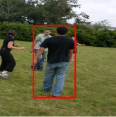
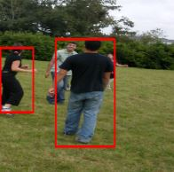
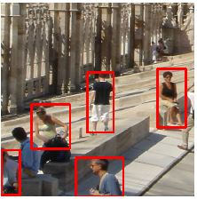
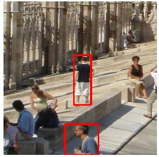
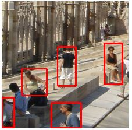

# Keras-Yolo-v2
A very basic re-implementation of Yolo v2 in Keras.
Both normal and tiny backbone models can be used. 

### Links to necessary weight files:
- [Tiny Yolo v2](https://pjreddie.com/media/files/yolov2-tiny-voc.weights)
- [Yolo v2](https://pjreddie.com/media/files/yolov2-voc.weights)

# Usage

### Loading the model:
```py
from tiny_yolo_v2 import TinyYOLOv2
# or from yolo_v2 import YOLOv2

IM_SIZE = 13*32
net = TinyYOLOv2(IM_SIZE)
net.loadWeightsFromDarknet(tiny_yolo_darknet_weight_file)
```
## Inference:
Output bounding boxes are in [left, top, right, bottom] format. The origin is at the top-left corner of the image. 

The forward function expects an array of dimensions `[None, IM_SIZE, IM_SIZE, 3]` or `[IM_SIZE, IM_SIZE, 3]`. 

- Regardless of the input, `results` is a list of tuples of length the number of images. 
- Each tuple contains a list of bounding boxes and a list of integer labels, where each label pairs up with a bounding box
```py
resized_image = resize(image, (IM_SIZE, IM_SIZE))
results = net.forward(resized_image)
```

## Once loaded from darknet files, weights can be saved to keras format:
```py
net.m.save(desired_keras_save_path)
```

## Then the models can be loaded without interacting with the darknet files:
(This is also quite a bit faster than the other method)
```py
from tiny_yolo_v2 import TinyYOLOv2
# or from yolo_v2 import YOLOv2

IM_SIZE = 13*32
net = TinyYOLOv2(IM_SIZE)
net.loadWeightsFromKeras(tiny_yolo_keras_weight_file)
```

# Example:

Ground Truth                         |  After a couple steps
:-----------------------------------:|:-------------------------:
 | 

(As we can see, the INRIA dataset annotations are pretty bad. In this case, the model detects an unannotated object)

# Training Example

### Create Model
```py
from tiny_yolo_v2 import TinyYOLOv2

trainnet = TinyYOLOv2(13 * 32, is_learning_phase=True)
```

### Create custom yolov2 loss and compile the underlying keras model
```py
from tiny_yolo_v2 import TINY_YOLOV2_ANCHOR_PRIORS as priors
from keras.optimizers import Adam
from yolov2_train import YoloLossKeras

loss = YoloLossKeras(priors, B=5, n_classes=20).loss
trainnet.m.compile(optimizer=Adam(lr=1e-4), loss=loss, metrics=None)
```

### Fit model
`bounding_boxes` is a list of `(x1, y1, x2, y2)`, while labels is a list of one-hot vectors.
`y_true` is a numpy array of same dimensionality as the network's output, containing all the necessary information to compute the yolov2 loss.
```py
from yolo_v2 import YOLOV2_ANCHOR_PRIORS as priors
from yolov2_train import processGroundTruth

image = imread(image_path)
bounding_boxes, labels = fetch_bounding_boxes_and_labels()

y_true = processGroundTruth(boxes, labels, priors, (13, 13, 5, 25)).reshape(1, 13, 13, 5 * 25)
trainnet.m.fit(image, y_true, steps_per_epoch=30, epochs=10)
```

# Overfitting on a single example (starting from random weights)


Ground Truth                  |  After a couple steps     | After more steps
:----------------------------:|:-------------------------:|:----------------:
  | |


Seems like we can overfit quite well! (the bounding boxes on the right-most image are in fact different to the ones in the left-most image)